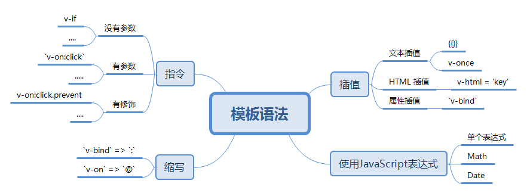
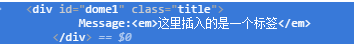

# Learn vue

## 1 模板语法



vue.js 使用了基于HTML的模板规范，可以以声明式的方式将 DOM 将 vue 实例中的数据绑定到一起；
vue 将模板编译成虚拟DOM渲染函数，当状态发生变化的时候， vue 能够智能的计算出重新渲染所需要的最小代价并应用到DOM操作上；

### 1.1 插值

#### 1.1.1 插入文本

[DOME1](./html/dome1.html)

`{{}}` || 指令：v-once

通过`{{}}`插入的文本是动态的，查找的是vue实例的data对象下的属性，每当数据进行修改的时候，就会重新渲染；

```html
<div id="dome1" v-on:click='clickHandle'>
    Message:{{message}}
</div>
<script type="text/javascript">
    var vm = new Vue ({
        el: '#dome1',
        data: {
            message: '这里是演示'
        },
        methods: {
            clickHandle: function() {
                this.message = '这里发生了修改'
            }
        }
    })
</script>
```

指令：v-once, 会取消动态性，在这个指令下的数据只能被渲染一次不能修改

```html
<div id="dome1" v-on:click='clickHandle' v-once>
    Message:{{message}}
</div>
```

注：这里插入的仅仅是文本，即使输入的是html格式的字符串，依旧是以文本的形式显示

#### 1.1.2 插入HTML

[DOME2](./html/dome2.html)

通过指令 `v-html` 可以将输入的内容识别成为html，但是这样就解除数据绑定
`v-html = key`

```html
    <div id="dome1" v-on:click='clickHandle' v-html="message">
        Message:{{message}}
    </div>
    data: {
        message: '<em>这里插入的是一个标签</em>'
    },
```

- 注:
    1. 不能使用 v-html 来复合局部模板，因为 Vue 不是基于字符串的模板引擎。组件更适合担任 UI 重用与复合的基本单元。
    2. 你的站点上动态渲染的任意 HTML 可能会非常危险，因为它很容易导致 XSS 攻击。请只对可信内容使用 HTML 插值，绝不要对用户提供的内容插值。

#### 1.1.3 插入属性

[DOME3](./html/dome3.html)

data中的属性不能直接作为元素的属性使用，如果想要添加为元素属性的话，应该使用`v-bind`

```html
<div id="dome1" v-bind:class='attr'>
    Message:{{message}}
</div>
<script type="text/javascript">
    var vm = new Vue ({
        el: '#dome1',
        data: {
            attr: 'title'
        }
    })
</script>
```



在这里 bind 的属性还可以使用布尔值

```html
<input type="checkbox" id='check' v-bind:checked="onOff">
<script type="text/javascript">
    var vm = new Vue ({
        el: '#check',
        data: {
            onOff: false
        }
    })
```

#### 1.1.4 使用JavaScript表达式

对于所有的数据绑定， Vue.js 都提供了完全的 JavaScript 表达式支持。

```html
<div id="dome1" v-bind:class='attr'>
    Message:{{message + '    这里是后来添加'}},
    {{1*10}},
    {{new Date()}}
    {{ok ? 'YES' : 'NO'}}
    {{message.split('').reverse().join('')}}
</div>
<script type="text/javascript">
    var vm = new Vue ({
        el: '#dome1',
        data: {
            attr: 'title',
            message: '这里是测试'
        }
    })
</script>
```

注：这些表达式会在所属 Vue 实例的数据作用域下作为 JavaScript 被解析。有个限制就是，每个绑定都只能包含单个表达式，语句和流程控制都不会生效

表达式：由数字、算符、数字分组符号（括号）、自由变量和约束变量等以能求得数值的有意义排列方法所得的组合

### 1.2 指令

指令（Directives）是带有 v- 前缀的特殊属性。指令属性的值预期是单一 JavaScript 表达式。指令的职责就是当其表达式的值改变时相应地将某些行为应用到 DOM 上。让我们回顾一下在介绍里的例子：

没有参数 || 有参数 || 有修饰

- 没有参数：

    以 v-if 为例，指令将根据表达式的值的真假来移除/插入
    [DOME6](./html/dome6.html)

    ```html
    <div id="dome6" v-if = "onOff" v-on:click.prevent="clickHandle">
        {{message}}
    </div>
    <script>
        var vm = new Vue ({
            el: '#dome6',
            data: {
                message: '这里是测试v-if',
                onOff: true
            },
            methods: {
                clickHandle (){
                    this.onOff = false
                }
            }
        })
    </script>
    ```

- 参数

    一些指令能接受一个“参数”，在指令后以冒号指明。例如，上面实例中的`v-on:click`

- 修饰符

    修饰符（Modifiers）是以半角句号 . 指明的特殊后缀，用于指出一个指定应该以特殊方式绑定。例如，上例中的 v-on:click.prevent 修饰符告诉 v-on 指令对于触发的事件调用 event.preventDefault()：

### 1.3 Filters 过滤器

注：Vue 2.x 中，过滤器只能在 mustache 绑定和 v-bind 表达式（从 2.1.0 开始支持）中使用，因为过滤器设计目的就是用于文本转换。为了在其他指令中实现更复杂的数据变换，你应该使用计算属性。

Vue.js 允许你自定义过滤器，被用作一些常见的文本格式化。过滤器应该被添加在 mustache 插值的尾部，由“管道符”指示：

`{{ message | capitalize }}` -- 大胡子语法 从左向右传输，message 为要过滤的对象，capitalize 定义过滤的规则

`<div v-bind:id="rawId | formatId"></div>`-- 绑定中

### 定义

定义过滤器函数有两种方法：

1. `Vue.filter(name, function(val){})`
    name--是定义过滤函数的名称，function--为规则，val--要过滤的内容
    ```html
        <div id="app">
            {{message | big}}
        </div>
        <script>
            Vue.filter('big', function(val) {
                return val.toUpperCase()
            })
            var app = new Vue({
                el: "#app",
                data: {
                    message: "this is learn for filter"
                }
            })
        </script>
    ```
2. 对象中定义 -- filters

    ```html
        <div id="app">
            {{message | big | add('这是通过传参，传入的字符串')}}
        </div>
        <script>
            Vue.filter('big', function(val) {
                return val.toUpperCase()
            })
            var app = new Vue({
                el: "#app",
                data: {
                    message: "this is learn for filter"
                },
                filters: {
                    add: function(val, str) {
                        return val + str
                    }
                }
            })
        </script>
    ```

### 传参

通过上面的例子还可以看出：对于过滤函数还可以进行传参，传入的参数是通过第二个形参传入的

### 1.4 缩写

在vue中，存在两种缩写：`v-bind` => `:`; `v-on` => `@`

```html
<div id="dome7" :class="style" @click="clickHandle">
    {{message}}
</div>
<script type="text/javascript">
    var vm = new Vue ({
        el: '#dome7',
        data: {
            style: 'redBox',
            message: '缩写'
        },
        methods: {
            clickHandle (){
                this.style = 'blueBox'
            }
        }
    })
</script>
```
