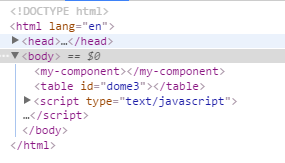
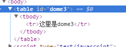
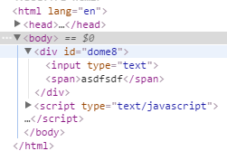

# Learn Vue -- 组件

## 1. 基础
### 1.1 什么是组件
组件（Component）是 Vue.js 最强大的功能之一。
1. 组件可以扩展 HTML 元素，封装可重用的代码。
2. 在较高层面上，组件是自定义元素， Vue.js 的编译器为它添加特殊功能。
3. 在有些情况下，组件也可以是原生 HTML 元素的形式，以 is 特性扩展。

### 1.2 使用组件

1. 注册
`Vue.component(tagName, options)`
[DOME1](./html/dome1.html)
```
<div id="dome1">
    <my-component></my-component>
</div>
<script type="text/javascript">
    // 注册
    Vue.component('my-component', {
        template: '<div>first component</div>'
    });
    // 创建根实例
    var vm = new Vue ({
        el: "#dome1"
    })
</script>
```
渲染成:
```
<div id="example">
  <div>A custom component!</div>
</div>
```

>注：对于自定义标签名，Vue.js 不强制要求遵循 W3C规则 （小写，并且包含一个短杠），尽管遵循这个规则比较好。

2. 局部注册
[DOME2](./html/dome2.html)
不必在全局注册每个组件。通过使用组件实例选项注册，可以使组件仅在另一个实例/组件的作用域中可用：

```
<div id="dome2">
    <my-component></my-component>
</div>
<script type="text/javascript">
    var Child = {
        template: '<div>这里是一个局部模块</div>'
    }
    var vm = new Vue ({
        el: '#dome2',
        components: {
            'my-component': Child
        }
    })
</script>
```

>注意:
这里是 components 而不是注册时用的 component  
这种封装也适用于其它可注册的 Vue 功能，如指令。

### 1.3 DOM模板解析说明
[DOME3](./html/dome3.html)
当使用 DOM 作为模版时（例如，将 el 选项挂载到一个已存在的元素上）, 你会受到 HTML 的一些限制，因为 Vue 只有在浏览器解析和标准化 HTML 后才能获取模版内容。尤其像这些元素 <ul> ， <ol>， <table> ， <select> 限制了能被它包裹的元素， <option> 只能出现在其它元素内部。

```
<table id="dome3">
    <my-component></my-component>
</table>
<script type="text/javascript">
    Vue.component("my-component", {
        template: '<tr>这里是dome3</tr>'
    })
    var vm = new Vue({
        el: '#dome3',
        data: {
            message: 'dome3'
        }
    })
</script>
```

这里被解析成：



这种情况下应该使用is 关键字

[DOME4](./html/dome4.html)

```
<table id="dome3">
    <tr is = 'my-component'></tr>
</table>
```

这里被解析成：



应当注意，如果您使用来自以下来源之一的字符串模板，这些限制将不适用：
- <script type="text/x-template">
- JavaScript内联模版字符串
- .vue 组件
因此，有必要的话请使用字符串模版。

### 1.4 data 必须是函数
[DOME5](./html/dome5.html)
使用组件时，大多数可以传入到 Vue 构造器中的选项可以在注册组件时使用，有一个例外： data 必须是函数。

```
<script type="text/javascript">
    Vue.component('simple-component', {
        template: '<button v-on:click="counter += 1">{{counter}}</button>',
        data {
            counter: 0
        }
    });
    var vm = new Vue ({
        el: '#dome5'
    })
</script>
```

会提示data只能是function

修改：
```
data: function () {
    return {
        counter: 0
    }
}
```

这里就可以使用counter；

如果需要共同一个counter：
```
var data = {counter: 0}
Vue.component('simple-component', {
    template: '<button v-on:click="counter += 1">{{counter}}</button>',
    data: function () {
        return data;
    }
});
```

## 2. 构成组件

组件意味着协同工作，通常父子组件会是这样的关系：组件 A 在它的模版中使用了组件 B 。它们之间必然需要相互通信：父组件要给子组件传递数据，子组件需要将它内部发生的事情告知给父组件。然而，在一个良好定义的接口中尽可能将父子组件解耦是很重要的。这保证了每个组件可以在相对隔离的环境中书写和理解，也大幅提高了组件的可维护性和可重用性。

在 Vue.js 中，父子组件的关系可以总结为 props down, events up 。父组件通过 props 向下传递数据给子组件，子组件通过 events 给父组件发送消息。看看它们是怎么工作的。


### 2.1 Prop

1. 使用Prop传递数据

[DOME6](./html/dome6.html)

组件实例的作用域是孤立的。这意味着不能并且不应该在子组件的模板内直接引用父组件的数据。可以使用 props 把数据传给子组件。

```
<div id="dome6">
    <child message='component-props'></child>
</div>
<script type="text/javascript">
    Vue.component('child', {
        props: ['message'],
        template: '<span>{{message}}</span>'
    });
    var vm = new Vue ({
        el: '#dome6'
    })
</script>
```

解析成：


### 2.2 camelCase vs. kebab-case

HTML 特性不区分大小写。当使用非字符串模版时，prop的名字形式会从 camelCase （驼峰） 转为 kebab-case（短横线隔开）：

也就是说如果接受的名称为驼峰式，属性就需要使用短横线隔开

```
<div id="dome7">
    <child my-message='component-props'></child>
</div>
<script type="text/javascript">
    Vue.component('child', {
        // 声明props
        props: ['myMessage'],
        // 同样可以像实例vm一样,使用'this.message'
        template: '<span>{{myMessage}}</span>'
    });
    var vm = new Vue ({
        el: '#dome7'
    })
</script>
```
再次说明，如果你使用字符串模版，不用在意这些限制。

### 2.3 动态Prop

配合 v-bind 可以实现动态绑定；
[DOME8](./html/dome8.html)
```
<div id="dome8">
    <input type="text" v-model='message'>
    <child v-bind:prop='message'></child>
</div>
<script type="text/javascript">
    Vue.component('child', {
        props:['prop'],
        template: '<span>{{prop}}</span>'
    })
    var vm = new Vue ({
        el: "#dome8",
        data: {
            message: ''
        }
    })
</script>
```

解析成：



### 2.4 字面量语法vs动态语法
[DOME9](./html/dome9.html)
使用字面量传递的数值是通过字符串的形式传播的，如果需要传入一个数值，需要使用动态语法

字面量：
```
<div id="dome9">
    <child message = '1'></child>
</div>
<script type="text/javascript">
    Vue.component('child',{
        props: ['message'],
        template: '<span>{{message}}</span>'
    })
    var vm = new Vue ({
        el: '#dome9'
    })
</script>
```

动态：
```
<div id="dome9">
    <child :message = 'num'></child>
</div>
<script type="text/javascript">
    Vue.component('child',{
        props: ['message'],
        template: '<span>{{message}}</span>'
    })
    var vm = new Vue ({
        el: '#dome9',
        data: {
            num: 1
        }
    })
</script>
```

### 2.5 单向数据流

prop 是单向绑定的：当父组件的属性变化时，将传导给子组件，但是不会反过来。这是为了防止子组件无意修改了父组件的状态——这会让应用的数据流难以理解。

另外，每次父组件更新时，子组件的所有 prop 都会更新为最新值。这意味着你不应该在子组件内部改变 prop 。如果你这么做了，Vue 会在控制台给出警告。

通常有两种改变 prop 的情况：
1. prop 作为初始值传入，子组件之后只是将它的初始值作为本地数据的初始值使用；
2. prop 作为需要被转变的原始值传入。

更确切的说这两种情况是：
1. 定义一个局部 data 属性，并将 prop 的初始值作为局部数据的初始值。
```
props: ['initialCounter'],
data: function () {
  return { counter: this.initialCounter }
}
```
2. 定义一个 computed 属性，此属性从 prop 的值计算得出。
```
props: ['size'],
computed: {
  normalizedSize: function () {
    return this.size.trim().toLowerCase()
  }
}
```

>注：
> 注意在 JavaScript 中对象和数组是引用类型，指向同一个内存空间，如果 prop 是一个对象或数组，在子组件内部改变它会影响父组件的状态。

### 2.6 Prop 验证

组件可以为 props 指定验证要求。如果未指定验证要求，Vue 会发出警告。当组件给其他人使用时这很有用。
prop 是一个对象而不是字符串数组时，它包含验证要求：
```
Vue.component('example', {
  props: {
    // 基础类型检测 （`null` 意思是任何类型都可以）
    propA: Number,
    // 多种类型
    propB: [String, Number],
    // 必传且是字符串
    propC: {
      type: String,
      required: true
    },
    // 数字，有默认值
    propD: {
      type: Number,
      default: 100
    },
    // 数组／对象的默认值应当由一个工厂函数返回
    propE: {
      type: Object,
      default: function () {
        return { message: 'hello' }
      }
    },
    // 自定义验证函数
    propF: {
      validator: function (value) {
        return value > 10
      }
    }
  }
})
```
type 可以是下面原生构造器：
String
Number
Boolean
Function
Object
Array
type 也可以是一个自定义构造器，使用 instanceof 检测。
当 prop 验证失败了，如果使用的是开发版本会抛出一条警告。
