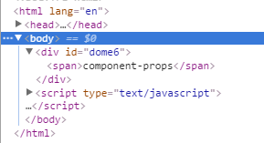
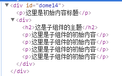
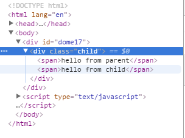

# Learn Vue -- 组件

## 1. 基础

### 1.1 什么是组件

组件（Component）是 Vue.js 最强大的功能之一。

1. 组件可以扩展 HTML 元素，封装可重用的代码。
2. 在较高层面上，组件是**自定义元素**， Vue.js 的编译器为它添加特殊功能。
3. 在有些情况下，组件也可以是原生 HTML 元素的形式，以 is 特性扩展。

### 1.2 使用组件

1. 注册
    `Vue.component(tagName, options)`
    [DOME1](./html/dome1.html)

     ```html
        <div id="dome1">
            <my-component></my-component>
        </div>
        <script type="text/javascript">
            // 注册
            Vue.component('my-component', {
                template: '<div>first component</div>'
            });
            // 创建根实例
            var vm = new Vue ({
                el: "#dome1"
            })
        </script>
     ```
    渲染成:

     ```html
        <div id="example">
        <div>A custom component!</div>
        </div>
     ```
    注：对于自定义标签名，Vue.js 不强制要求遵循 W3C规则 （小写，并且包含一个短杠），尽管遵循这个规则比较好。

2. 局部注册

    [DOME2](./html/dome2.html)
    不必在全局注册每个组件。通过使用组件实例选项注册，可以使组件仅在另一个实例/组件的作用域中可用：

    ```html
    <div id="dome2">
        <my-component></my-component>
    </div>
    <script type="text/javascript">
        var Child = {
            template: '<div>这里是一个局部模块</div>'
        }
        var vm = new Vue ({
            el: '#dome2',
            components: {
                'my-component': Child
            }
        })
    </script>
    ```

    注意:
    这里是 components 而不是注册时用的 component
    这种封装也适用于其它可注册的 Vue 功能，如指令。

### 1.3 DOM模板解析说明

[DOME3](./html/dome3.html)

当使用 DOM 作为模版时（例如，将 el 选项挂载到一个已存在的元素上）, 你会受到 HTML 的一些限制，因为 Vue 只有在浏览器解析和标准化 HTML 后才能获取模版内容。尤其像这些元素 `<ul>` ， `<ol>`， `<table>` ， `<select>` 限制了能被它包裹的元素， `<option>` 只能出现在其它元素内部。

    ```html
        <table id="dome3">
            <my-component></my-component>
        </table>
        <script type="text/javascript">
            Vue.component("my-component", {
                template: '<tr>这里是dome3</tr>'
            })
            var vm = new Vue({
                el: '#dome3',
                data: {
                    message: 'dome3'
                }
            })
        </script>
    ```

这里被解析成：


这种情况下应该使用is 关键字

[DOME4](./html/dome4.html)

```html
<table id="dome3">
    <tr is = 'my-component'></tr>
</table>
```

这里被解析成：


应当注意，如果您使用来自以下来源之一的字符串模板，这些限制将不适用：

- `<script type="text/x-template">`
- JavaScript内联模版字符串
- .vue 组件

因此，有必要的话请使用字符串模版。

### 1.4 data 必须是函数

[DOME5](./html/dome5.html)
使用组件时，大多数可以传入到 Vue 构造器中的选项可以在注册组件时使用，有一个例外： data 必须是函数。

```html
<script type="text/javascript">
    Vue.component('simple-component', {
        template: '<button v-on:click="counter += 1">{{counter}}</button>',
        data {
            counter: 0
        }
    });
    var vm = new Vue ({
        el: '#dome5'
    })
</script>
```

会提示data只能是function, 否则会停止 Vue 并在后台发出警告，考诉你在组件中 data 必须是一个函数；

修改：

```js
data: function () {
    return {
        counter: 0
    }
}
```

这里就可以使用counter；
如果需要共同一个counter, 可以通过使用同一个 data 对象来实现；

```js
var data = {counter: 0}
Vue.component('simple-component', {
    template: '<button v-on:click="counter += 1">{{counter}}</button>',
    data: function () {
        return data;
    }
});
```

## 2. 构成组件

组件意味着协同工作，通常父子组件会是这样的关系：组件 A 在它的模版中使用了组件 B 。它们之间必然需要相互通信：父组件要给子组件传递数据，子组件需要将它内部发生的事情告知给父组件。然而，在一个良好定义的接口中尽可能将父子组件解耦是很重要的。这保证了每个组件可以在相对隔离的环境中书写和理解，也大幅提高了组件的可维护性和可重用性。

在 Vue.js 中，父子组件的关系可以总结为 props down, events up 。父组件通过 props 向下传递数据给子组件，子组件通过 events 给父组件发送消息。看看它们是怎么工作的。


### 2.1 Prop

1. 使用Prop传递数据

    [DOME6](./html/dome6.html)

    组件实例的作用域是孤立的。这意味着不能并且不应该在子组件的模板内直接引用父组件的数据。可以使用 props 把数据传给子组件。

    示例：向组件中传入一个普通字符串

    ```html
    <div id="dome6">
        <child message='component-props'></child>
    </div>
    <script type="text/javascript">
        Vue.component('child', {
            props: ['message'],
            template: '<span>{{message}}</span>'
        });
        var vm = new Vue ({
            el: '#dome6'
        })
    </script>
    ```

    解析成：

    

2. camelCase vs. kebab-case

    HTML 特性不区分大小写。当使用非字符串模版时，prop的名字形式会从 camelCase （驼峰） 转为 kebab-case（短横线隔开）：

    也就是说如果接受的名称为驼峰式，属性就需要使用短横线隔开

    ```html
    <div id="dome7">
        <child my-message='component-props'></child>
    </div>
    <script type="text/javascript">
        Vue.component('child', {
            // 声明props
            props: ['myMessage'],
            // 同样可以像实例vm一样,使用'this.message'
            template: '<span>{{myMessage}}</span>'
        });
        var vm = new Vue ({
            el: '#dome7'
        })
    </script>
    ```

    再次说明，如果你使用字符串模版，不用在意这些限制。

3. 动态Prop

    配合 v-bind 可以实现动态绑定；
    [DOME8](./html/dome8.html)

    ```html
    <div id="dome8">
        <input type="text" v-model='message'>
        <child v-bind:prop='message'></child>
    </div>
    <script type="text/javascript">
        Vue.component('child', {
            props:['prop'],
            template: '<span>{{prop}}</span>'
        })
        var vm = new Vue ({
            el: "#dome8",
            data: {
                message: ''
            }
        })
    </script>
    ```

    解析成：

    

4. 字面量语法vs动态语法

    [DOME9](./html/dome9.html)
    使用字面量传递的数值是通过字符串的形式传播的，如果需要传入一个数值，需要使用动态语法
    字面量：

    ```html
        <div id="dome9">
            <child message = '1'></child>
        </div>
        <script type="text/javascript">
            Vue.component('child',{
                props: ['message'],
                template: '<span>{{message}}</span>'
            })
            var vm = new Vue ({
                el: '#dome9'
            })
        </script>
    ```

    动态：

    ```html
        <div id="dome9">
            <child :message = 'num'></child>
        </div>
        <script type="text/javascript">
            Vue.component('child',{
                props: ['message'],
                template: '<span>{{message}}</span>'
            })
            var vm = new Vue ({
                el: '#dome9',
                data: {
                    num: 1
                }
            })
        </script>
    ```

5. 单向数据流

    prop 是单向绑定的：当父组件的属性变化时，将传导给子组件，但是不会反过来。这是为了防止子组件无意修改了父组件的状态——这会让应用的数据流难以理解。  
    另外，每次父组件更新时，子组件的所有 prop 都会更新为最新值。这意味着你不应该在子组件内部改变 prop 。如果你这么做了，Vue 会在控制台给出警告。  

    通常有两种改变 prop 的情况：

    1. prop 作为初始值传入，子组件之后只是将它的初始值作为本地数据的初始值使用(子组件修改数据=>全局都产生变化)；
    2. prop 作为需要被转变的原始值传入。

    最好使用下面两种方式解决上述情况：

    1. 定义一个局部 data 属性，并将 prop 的初始值作为局部数据的初始值。

            ```js
                    props: ['initialCounter'],
                    data: function () {
                    return { counter: this.initialCounter }
                    }
            ```

    2. 定义一个 computed 属性，此属性从 prop 的值计算得出。

            ```js
                props: ['size'],
                computed: {
                    normalizedSize: function () {
                        return this.size.trim().toLowerCase()
                    }
                }
            ```
    - 注：在 JavaScript 中对象和数组是引用类型，指向同一个内存空间，**如果 prop 是一个对象或数组**，在子组件内部改变它会影响父组件的状态。

6. Prop 验证

    组件可以为 props 指定验证要求。如果未指定验证要求，Vue 会发出警告。当组件给其他人使用时这很有用。
    prop 是一个对象而不是字符串数组时，它包含验证要求：

        ```js
            Vue.component('example', {
            props: {
                // 基础类型检测 （`null` 意思是任何类型都可以）
                propA: Number,
                // 多种类型
                propB: [String, Number],
                // 必传且是字符串
                propC: {
                type: String,
                required: true
                },
                // 数字，有默认值
                propD: {
                type: Number,
                default: 100
                },
                // 数组／对象的默认值应当由一个工厂函数返回
                propE: {
                type: Object,
                default: function () {
                    return { message: 'hello' }
                }
                },
                // 自定义验证函数
                propF: {
                validator: function (value) {
                    return value > 10
                }
                }
            }
            })
        ```

    type 可以是下面原生构造器： `String Number Boolean Function Object Array`

    type 也可以是一个自定义构造器，使用 instanceof 检测。
    当 prop 验证失败了，如果使用的是开发版本会抛出一条警告。
7. 非 Prop 属性
    所谓非 prop 属性，就是他可以直接传入组件，而不需要定义相应的 prop；
    明确指定 prop 是推荐的操作，但是有时组件的作者，并不能知道组件的使用场景，所以组件可以接受任意传入的属性，这些属性会陪添加到组件的根元素上；

    ```html
        <div id="app">
            <my-app bs="true" :key="1" :mes="message"></my-app>
        </div>
        <script>
            Vue.component ('my-app', {
                props: ['mes'],
                template: "<div>hi {{mes}}</div>"
            })
            var app = new Vue({
                el: '#app',
                data: {
                    message: 'this is a apple'
                }
            });
        </script>
    ```
    这里 bs 属于自己添加的属性，会保存下载
8. 替换、覆盖现有属性
    对于多数特性来说，传递给组件的值会覆盖组件本身设定的值，甚至可能会破坏组件，但是 class 和 style 做了特殊处理，和组件并非属于覆盖关系，而是会和组件内本身设定的值进行合并；

### 2.2 自定义事件

父组件是使用 props 传递数据给子组件，但如果子组件要把数据传递回去就需要使用自定义事件！

1. 使用 `v-on` 绑定自定义事件

    每个 Vue 实例都实现了事件接口(Events interface)，即：
    使用 $on(eventName) 监听事件
    使用 $emit(eventName) 触发事件

    - 注：

        1. Vue的事件系统分离自浏览器的EventTarget API。尽管它们的运行类似，但是$on 和 $emit 不是addEventListener 和 dispatchEvent 的别名, 但是都是先绑定自定义时间，然后主动触发的行为；
        2. 另外，父组件可以在使用子组件的地方直接用 v-on 来监听子组件触发的事件。

    [DOME11](./html/dome11.html)

        ```html
            <div id="wrap-event">
                <p>{{ total }}</p>
                <button-counter v-on:emit-increment="counterTotal"></button-counter>
                <button-counter v-on:emit-increment="counterTotal"></button-counter>
            </div>
            <script type="text/javascript">
                Vue.component('button-counter', {
                    template: '<button v-on:click="increment">{{counter}}</button>',
                    data: function () {
                        return {
                            counter: 0
                        }
                    },
                    methods: {
                        increment: function (){
                            this.counter++;
                            this.$emit('emit-increment')
                        }
                    }
                });
                var vm = new Vue({
                    el: '#wrap-event',
                    data: {
                        total: 0
                    },
                    methods: {
                        counterTotal: function () {
                            this.total += 1
                        }
                    }
                })
            </script>
        ```

    - 注：
        1. 通过在组件元素上 `v-on` 将父级事件挂在子组件上，然后起一个自定义的事件名`v-on:事件名="父级事件"`
        2. 由于子组件的模块中，只能使用组件自身的属性和方法，不能调用父组件，所以需要使用 $emit(), 对绑定的自定义事件进行触发；
        3. 使用这种方式建立子组件向父组件传递消息，可以保证子组件的独立性；

2. 给组件绑定原生事件

    有时候，你可能想在某个组件的根元素上监听一个原生事件(不是模板事件)。可以使用 .native 修饰 v-on 。例如：

    [DOME12](./html/dome12.html)

        ```html
            <my-component id="dome12" v-on:click.native='doTheThing'></my-component>
            <script type="text/javascript">
                Vue.component('my-component', {
                    template: "<button>12</button>",

                });
                var vm = new Vue({
                    el: '#dome12',
                    methods: {
                        doTheThing: function (){
                            console.log(1);
                        }
                    }
                })
            </script>
        ```

    - 注：这里的原生事件是指，在 vue 组件自定义标签中使用原生方法需要使用 native 修饰符，如果没有 native，就不能直接使用click方法；

3. `.sync` 修饰符
    **vue-2.3.0 支持**

    在一些情况下我们需要对一个 prop 进行双向绑定，也就是说当一个子组件改变了一个 prop 的值的时候，这个变化也会同步到父组件中所绑定的值，但是这种方式又会破坏单向数据流的假设，无法保证子组件和父组件之间的独立性，这样你完全不知道它何时悄悄地改变了父组件的状态。这在 debug 复杂结构的应用时会带来很高的维护成本；
    在 vue 中提供了一个建议的方式，用于主动更新 prop 关联的数据；

    ```html
        <div id="app">
            <p>{{bar}}</p>
            <my-app :foo.sync="bar"></my-app>
        </div>
        <script>
            Vue.component ('my-app', {
                props: ['foo'],
                template: "<div @click='upData'>{{foo}}</div>",
                methods: {
                    upData () {
                        console.log(1);
                        this.$emit('update:foo', 'change')
                    }
                }
            });
            var app = new Vue({
                el: "#app",
                data: {
                    bar: 'noChange'
                },
                methods: {
                    upData () {
                        console.log(0);
                    }
                }
            })
        </script>
    ```

    其实 .sync 仅仅是一个语法糖 `<comp :foo.sync="bar"></comp>` 相当于 `<comp :foo="bar" @update:foo="val => bar = val"></comp>`，然后通过 `$emit('update:名称', 新值)` 将新增赋给绑定的数据

    - 注： vue 中不建议直接对 prop 绑定的数据直接修改；

4. 使用自定义事件的表单输入组件

    自定义事件也可以用来创建自定义的表单输入组件，使用 v-model 来进行数据双向绑定。牢记：`<input v-model="something">` 仅仅是一个语法糖：

    ```html
        <input v-bind:value="something" v-on:input="something = $event.target.value">
    ```

    所以在组件中使用时，它相当于下面的简写：

    ```html
        `<custom-input v-bind:value="something" v-on:input="something = arguments[0]"></custom-input>`
    ```

    而在组件中使用的使用，就不能通过 `v-model` 来实现同步更新了，所以要让组件的 v-model 生效，就必须要手动实现了
    接受一个 value 属性
    在有新的 value 时触发 input 事件

    示例：
        ```html
            <div id="app">
                <p>{{bar}}</p>
                <my-app v-model="bar"></my-app>
                <!-- v-model 相当于 :value="bar" 和 @input="bar=$event.target.value"  -->
            </div>
            <script>
                Vue.component ('my-app', {
                    props: ['value'],
                    template:  '\
                        <span>\
                            <input\
                                ref="input"\
                                v-bind:value="value"\
                                v-on:input="updateValue($event.target.value)"\
                            >\
                        </span>\
                    ',
                    methods: {
                        updateValue (val) {
                            console.log(1);
                            this.$emit('input', val)
                        }
                    }
                });
                var app = new Vue({
                    el: "#app",
                    data: {
                        bar: 'noChange'
                    },
                    methods: {
                        upData () {
                            console.log(0);
                        }
                    }
                })
            </script>
        ```
    这种方式是将组件内部的输入和父组件的数据建立关联；

5. 定制组件的 v-model **2.2.0 新增**

    默认情况下，一个组件的 v-model 会使用 value 属性和 input 事件，但是诸如单选框、复选框之类的输入类型可能把 value 属性用作了别的目的。model 选项可以回避这样的冲突：
    在组件中可以指定 model 中绑定的数据名，以及事件名；

        ```js
            Vue.component('my-checkbox', {
            model: {
                prop: 'checked',
                event: 'change'
            },
            props: {
                checked: Boolean,
                // this allows using the `value` prop for a different purpose
                value: String
            },
            // ...
            })
        ```
        ```html
            <my-checkbox v-model="foo" value="some value"></my-checkbox>
        ```
    相当于:

        ```html
            <my-checkbox
                :checked="foo"
                @change="val => { foo = val }"
                value="some value"
            >
            </my-checkbox>
        ```
        
6. 非父子组件通讯

    有时候非父子关系的组件也需要通信。在简单的场景下，使用一个空的 Vue 实例作为中央事件总线，事件绑定到自己身上，并且由自己触发；

        ```js
            var bus = new Vue()
            // 触发组件 A 中的事件
            bus.$emit('id-selected', 1)
            // 在组件 B 创建的钩子中监听事件
            bus.$on('id-selected', function (id) {
            // ...
            })
        ```

    - 注：使用空的Vue来监听和触发一个事件

## 3. 使用 Slot 分发内容

在使用组件的过程中，常常存在组合的情况

    ```html
        <app>
        <app-header></app-header>
        <app-footer></app-footer>
        </app>
    ```

- 注意：
    1. `<app>` 组件不知道它的挂载点会有什么内容。挂载点的内容是由`<app>`的父组件决定的。
    2. `<app>` 组件很可能有它自己的模版。

    为了让组件可以组合，我们需要一种方式来混合父组件的内容与子组件自己的模块。这个过程被称为 内容分发。Vue.js 实现了一个内容分发 API ，参照了当前 Web 组件规范草案，使用特殊的 `<slot>` 元素作为原始内容的插槽。

### 3.1 编译作用域

[DOME13](./html/dome13.html)

    ```html
        <body>
            <div id="dome13">
                <my-component :me1='message'>
                    {{message}} <!-- 不能被渲染 -->
                </my-component>
            </div>
            <script type="text/javascript">
                Vue.component('my-component', {
                    props: ['me1'],
                    template: '<span :me2="sonMes">{{sonMes}}</span>',
                    data: function () {
                        return {
                            sonMes: 'son'
                        }
                    }

                })
                var vm = new Vue({
                    el: '#dome13',
                    data: {
                        message: 'father'
                    }
                })
            </script>
        </body>
    ```

渲染后：

- 注：
    1. 可以 m1 是在父组件的作用域中编译的，所以使用父组件的属性；
    2. 对于在template中的使用的，存在于子组件中,使用了子组件的属性；

### 3.2 Slot

1. 单个 Slot

    通常在使用模块中，父组件内部的模块的内容并不会保留下来，上述示例中的 `{{message}}` 就不会保留，如果需要保留这些内容就需要在模块中存在一个 slot 插口，当子组件模块 (template) 中只存在一个没有属性的slot时，父组件的内容，就会全部保留下来，并且插入到 template 中的 slot所在的DOM位置，并替换slot；

    最初在 `<slot>` 标签中的任何内容都被视为备用内容。备用内容在子组件的作用域内编译，并且只有在宿主元素为空，且没有要插入的内容时才显示备用内容。

    [DOME14](./html/dome14.html)

        ```html
            <div id="dome14">
                <p>这里是初始内容标题</p>
                <my-component>
                    <p>这里是子组件的初始内容</p>
                    <p>这里是子组件的初始内容</p>
                    <p>这里是子组件的初始内容</p>
                    <p>这里是子组件的初始内容</p>
                </my-component>
            </div>
            <script type="text/javascript">
                Vue.component('my-component', {
                    template: '<div>\
                        <h2>这是子组件的主题</h2>\
                        <slot>\
                            这里的是没有分发的内容的时候才会显示\
                        </slot>\
                    </div>'
                })
                var vm = new Vue({
                    el: "#dome14"
                })
            </script>
        ```

    渲染后：

    

    - 注：这里的`<p>这里是子组件的初始内容</p>`如果不存在就会渲染slot内部的备用内容；

2. 具名的 Slot

    `<slot>` 元素可以用一个特殊的属性 name 来配置如何分发内容。多个 slot 可以有不同的名字。具名 slot 将匹配内容片段中有对应 slot 特性的元素

    [DOME15](./html/dome15.html)

        ```html
            <div id="dome15">
                <app-layout>
                    <h1 slot='head'>这里使用的slot</h1>
                    {{message}}
                </app-layout>
            </div>
            <script type="text/javascript">
                Vue.component('app-layout', {
                    template: '<div><slot name="head"></slot></div>'
                });
                var vm = new Vue({
                    el: "#dome15",
                    data: {
                        message: 'new year'
                    }
                })
            </script>
        ```

    - 注：这里的`'<div><slot name="head"></slot></div>'`仅仅只会保留父组件中具有 `slot=head` 属性的内容；而message就会被抛弃掉；

    并且多个slot可以同时使用
    [DOME16](./html/dome16.html)

        ```js
            Vue.component('app-layout', {
                template: '\
                    <div>\
                        <slot name="head"></slot>\
                        <em>\
                            <slot></slot>\
                        </em>\
                    </div>\
                    '
            });
        ```

    - 注：
        1. 这里的slot标签，会保留其余内容;
        2. 这种机制，就是前面说的内容分配；

3. 作用域插槽 **2.1.0 新增**

    作用域插槽(scope)是一种特殊类型的插槽，用作使用一个（能够传递数据到）可重用模板替换已渲染元素。具体就是通过 slot 进行数据传递，例如：在父组件中已经存在的元素，通过 slot 和子组件进行混合；但是混合的时候希望渲染的数据，由子组件控制就可以使用作用域插槽

    在子组件中，只需将数据添加到 slot 的属性上就可以了；然后父组件中需要使用 `template` 标签，并且在 template 标签上使用特殊属性 `scope` 进行接收；scope 中的值对应的是一个对象，从子组件传递过来的数据都挂在到这个对象上；
    
    [DOME17](./html/dome17.html)

        ```html
            <div id="dome17">
            <child>
                <template scope="props">
                <span>hello from parent</span>
                <span>{{ props.text }}</span>
                </template>
            </child>
            </div>
            <script type="text/javascript">
                Vue.component('child',{
                    template:'<div class="child">\
                        <slot :text="hello from child"></slot>\
                        </div>'
                })
                var vm = new Vue({
                    el: "#dome17"
                })
            </script>
        ```

    渲染成：

    - 注：在父级中，具有特殊属性 scope 的 `<template>` 元素，表示它是作用域插槽的模板。scope 的值对应一个临时变量名，此变量接收从子组件中传递的 prop 对象，从而将子作用域的prop对象，移入到全局域中：

    作用域插槽更具代表性的用例是列表组件，允许组件自定义应该如何渲染列表每一项：

    [DOME18](./html/dome18.html)

        ```html
            <div id="dome18">
                <my-awesome-list>
                    <template slot="item" scope="props">
                        <li class="my-fancy-item">{{ props.con }}</li>
                    </template>
                </my-awesome-list>
            </div>
            <script type="text/javascript">
            Vue.component('my-awesome-list', {
                    template: '<ul>\
                        <slot\
                            name = "item"\
                            v-for = "item in items"\
                            :con = "item.text"\
                        >\
                        </slot>\
                    </ul>',
                    data: function() {
                        return {
                            items: [{
                                text: 'list1'
                            }, {
                                text: 'list2'
                            }]
                        }
                    }
                })
                var vm = new Vue({
                    el: '#dome18',
                })
            </script>
        ```

### 3.3 动态组件

多个组件可以使用同一个挂载点，然后动态地在它们之间切换。使用保留的 `<component>` 元素，动态地绑定到它的 is 特性：

[DOME19](./html/dome19.html)

    ```html
        <div id="wrap"  v-on:mouseover='handleClick'>
            <component v-bind:is='currentCom'></component>
        </div>
        <script type="text/javascript">
            var vm = new Vue({
                el: "#wrap",
                data: {
                    currentCom: 'home'
                },
                components: {
                    home: {template:'<div>这里是home,移入的时候会变成post</div>'},
                    post: {template:'<em>这里是post</em>'}
                },
                methods: {
                    handleClick () {
                        console.log(1);
                        this.currentCom = 'post'
                    }
                }
            })
        </script>
    ```

也可以直接绑定到组件对象上；

    ```js
        var home = {
            template: '<p>这里是组件对象上的模板</p>'
        }
        var vm = new Vue({
        el: "#wrap",
        data: {
            currentCom: home
        },

        .......
    ```

1. keep-alive

    如果把切换出去的组件保留在内存中，可以保留它的状态或避免重新渲染。为此可以添加一个 keep-alive 指令参数：

    ```html
        <keep-alive>
            <component :is="currentView">
                <!-- 非活动组件将被缓存！ -->
            </component>
        </keep-alive>
    ```

    在API 参考查看更多 `<keep-alive>` 的细节。

### 3.4 杂项：

1. 编写可复用组件

    - 在编写组件时，记住是否要复用组件有好处。一次性组件跟其它组件紧密耦合没关系，但是可复用组件应当定义一个清晰的公开接口。
    - Vue 组件的 API 来自三部分 - props, events 和 slots ：
        Props 允许外部环境传递数据给组件
        Events 允许组件触发外部环境的副作用
        Slots 允许外部环境将额外的内容组合在组件中。
    - 使用 v-bind 和 v-on 的简写语法，模板的缩进清楚且简洁：

    ```html
        <my-component
            :foo="baz"
            :bar="qux"
            @event-a="doThis"
            @event-b="doThat"
            >
            
            <p slot="main-text">Hello!</p>
        </my-component>
    ```

2. 子组件索引

    尽管有 props 和 events ，但是有时仍然需要在 JavaScript 中直接访问子组件。为此可以使用 ref 为子组件指定一个索引 ID 。例如：

    ```js
        <div id="parent">
        <user-profile ref="profile"></user-profile>
        </div>
        var parent = new Vue({ el: '#parent' })
        // 访问子组件
        var child = parent.$refs.profile
    ```

    当 ref 和 v-for 一起使用时， ref 是一个数组或对象，包含相应的子组件。

    - 注：$refs 只在组件渲染完成后才填充，之前是访问不到的，并且它是非响应式的。所以它仅仅作为一个直接访问子组件的应急方案——应当避免在**模版或计算属性**中使用 $refs 。

3. 异步组件
    在大型的应用中，我们可能需要将应用拆分为多个小模块，按需从服务器上下载；在 vue 中，就为了这个目的提供一个方便的解决方式；在定义组件的时候，可以出发一个工厂函数，并且会将结果缓存起来，用于以后的调用
    例如：

        ```js
            Vue.component('sync', function (resolve, reject){
                function (){
                    resolve()
                }
            })
        ```
    由于目前难以涉及到这个情况，具体可以查看 [异步组件](https://cn.vuejs.org/v2/guide/components.html#异步组件) 主要是要知道在 vue 中提供这样的一种解决方案；

4. 组件的命名规定

    当注册组件（或者 props）时，可以使用 kebab-case ，camelCase ，或 TitleCase 。Vue 不关心这个。

    但是在 HTML 模版中，请使用 kebab-case 形式：

    如果组件未经 slot 元素传递内容，你甚至可以在组件名后使用 / 使其自闭合：`<my-component/>`
    当然，这只在字符串模版中有效。因为自闭的自定义元素是无效的 HTML ，浏览器原生的解析器也无法识别它。

5. 递归组件

    组件在它的模板内可以递归地调用自己，不过，只有当子组件有 name 选项时才可以：
    `name: 'unique-name-of-my-component'`
    当你利用 Vue.component 全局注册了一个组件, 全局的ID作为组件的 name 选项，被自动设置.

        ```js
            Vue.component('unique-name-of-my-component', {
                 // ...
            })
        ```

    如果你不谨慎, 递归组件可能导致死循环:

        ```js
            name: 'stack-overflow',
            template: '<div><stack-overflow></stack-overflow></div>'
        ```

    上面组件会导致一个错误 “max stack size exceeded” ，所以要确保递归调用有终止条件 (比如递归调用时使用 v-if 并让他最终返回 false )。

6. 使用 v-once 的低级静态组件(Cheap Static Component)

    尽管在 Vue 中渲染 HTML 很快，不过当组件中包含大量静态内容时，可以考虑使用 v-once 将渲染结果缓存起来，就像这样：

        ```js
            Vue.component('terms-of-service', {
            template: '\
                <div v-once>\
                <h1>Terms of Service</h1>\
                ... a lot of static content ...\
                </div>\
            '
            })
        ```
