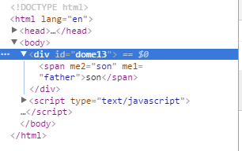
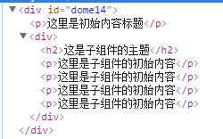
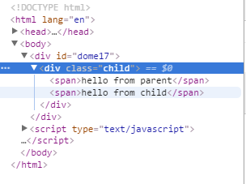

## 3. 自定义事件

父组件是使用 props 传递数据给子组件，但如果子组件要把数据传递回去就需要使用自定义事件！

### 3.1 使用 `v-on` 绑定自定义事件
每个 Vue 实例都实现了事件接口(Events interface)，即：
使用 $on(eventName) 监听事件
使用 $emit(eventName) 触发事件

>注：
1. Vue的事件系统分离自浏览器的EventTarget API。尽管它们的运行类似，但是$on 和 $emit 不是addEventListener 和 dispatchEvent 的别名。
2. 另外，父组件可以在使用子组件的地方直接用 v-on 来监听子组件触发的事件。

另外，父组件可以在使用子组件的地方直接用 v-on 来监听子组件触发的事件。
[DOME11](./html/dome11.html)
```
<div id="wrap-event">
    <p>{{ total }}</p>
    <button-counter v-on:emit-increment="counterTotal"></button-counter>
    <button-counter v-on:emit-increment="counterTotal"></button-counter>
</div>
<script type="text/javascript">
    Vue.component('button-counter', {
        template: '<button v-on:click="increment">{{counter}}</button>',
        data: function () {
            return {
                counter: 0
            }
        },
        methods: {
            increment: function (){
                this.counter++,
                this.$emit('emit-increment')
            }
        }
    });
    var vm = new Vue({
        el: '#wrap-event',
        data: {
            total: 0
        },
        methods: {
            counterTotal: function () {
                this.total += 1
            }
        }
    })
</script>
```

>注：
> 1. 子组件的模块中，只能使用组件自身的属性和方法，不能调用父组件；
> 2. 可以通过`$emit()`触发自定义的时间--（emit-increment）

### 3.2 给组件绑定原生事件

有时候，你可能想在某个组件的根元素上监听一个原生事件。可以使用 .native 修饰 v-on 。例如：

[DOME12](./html/dome12.html)

```
<my-component id="dome12" v-on:click.native='doTheThing'></my-component>
<script type="text/javascript">
    Vue.component('my-component', {
        template: "<button>12</button>",

    });
    var vm = new Vue({
        el: '#dome12',
        methods: {
            doTheThing: function (){
                console.log(1);
            }
        }
    })
</script>
```
>注：这里的原生事件是指，在vue对象中的方法，如果没有 native 的修饰，就不能直接使用click方法；

### 3.3 使用自定义事件的表单输入组件

自定义事件也可以用来创建自定义的表单输入组件，使用 v-model 来进行数据双向绑定。牢记：
`<input v-model="something">`

仅仅是一个语法糖：

`<input v-bind:value="something" v-on:input="something = $event.target.value">`

所以在组件中使用时，它相当于下面的简写：

`<custom-input v-bind:value="something" v-on:input="something = arguments[0]"></custom-input>`

所以要让组件的 v-model 生效，它必须：
接受一个 value 属性
在有新的 value 时触发 input 事件

### 3.4 非父子组件通讯

有时候非父子关系的组件也需要通信。在简单的场景下，使用一个空的 Vue 实例作为中央事件总线：
```
var bus = new Vue()
// 触发组件 A 中的事件
bus.$emit('id-selected', 1)
// 在组件 B 创建的钩子中监听事件
bus.$on('id-selected', function (id) {
  // ...
})
```
注：使用空的Vue来监听和触发一个事件

### 3.5 使用 Slot 分发内容

在使用组件的过程中，常常存在组合的情况
```
<app>
  <app-header></app-header>
  <app-footer></app-footer>
</app>
```
注意两点：
1. <app> 组件不知道它的挂载点会有什么内容。挂载点的内容是由<app>的父组件决定的。
2. <app> 组件很可能有它自己的模版。
为了让组件可以组合，我们需要一种方式来混合父组件的内容与子组件自己的模块。这个过程被称为 内容分发 (或 “transclusion” 如果你熟悉 Angular)。Vue.js 实现了一个内容分发 API ，参照了当前 Web 组件规范草案，使用特殊的 <slot> 元素作为原始内容的插槽。

#### 3.5.1 编译作用域
[DOME13](./html/dome13.html)
```
<div id="dome13">
    <my-component :me1='message'>
        {{message}} <!-- 不能被渲染 -->
    </my-component>
</div>
<script type="text/javascript">
    Vue.component('my-component', {
        template: '<span :me2="message">{{message}}</span>',
        data: function () {
            return {
                message: 'son'
            }
        }

    })
    var vm = new Vue({
        el: '#dome13',
        data: {
            message: 'father'
        }
    })
</script>
```

渲染后：


注：
1. 可以 m1 是在父组件的作用域中编译的，所以使用父组件的属性；
2. 对于在template中的使用的，存在于子组件中,使用了子组件的属性；

#### 3.5.2 单个Slot

通常在使用模块中，父组件内部的模块的内容并不会保留下来，如果需要保留这些内容就需要在模块中存在一个 slot 插口，当子组件模块中只存在一个没有属性的slot时，父组件的内容，就会全部保留下来，并且插入到slot所在的DOM位置，并替换slot；

最初在 <slot> 标签中的任何内容都被视为备用内容。备用内容在子组件的作用域内编译，并且只有在宿主元素为空，且没有要插入的内容时才显示备用内容。

[DOME14](./html/dome14.html)

```
<div id="dome14">
    <p>这里是初始内容标题</p>
    <my-component>
        <p>这里是子组件的初始内容</p>
        <p>这里是子组件的初始内容</p>
        <p>这里是子组件的初始内容</p>
        <p>这里是子组件的初始内容</p>
    </my-component>
</div>
<script type="text/javascript">
    Vue.component('my-component', {
        template: '<div>\
            <h2>这是子组件的主题</h2>\
            <slot>\
                这里的是没有分发的内容的时候才会显示\
            </slot>\
        </div>'
    })
    var vm = new Vue({
        el: "#dome14"
    })
</script>
```
渲染后：



>注：这里的`<p>这里是子组件的初始内容</p>`如果不存在就会渲染slot内部的备用内容；

#### 3.5.3 具名的 Slot

<slot> 元素可以用一个特殊的属性 name 来配置如何分发内容。多个 slot 可以有不同的名字。具名 slot 将匹配内容片段中有对应 slot 特性的元素

[DOME15](./html/dome15.html)

```
<div id="dome15">
    <app-layout>
        <h1 slot='head'>这里使用的slot</h1>
        {{message}}
    </app-layout>
</div>
<script type="text/javascript">
    Vue.component('app-layout', {
        template: '<div><slot name="head"></slot></div>'
    });
    var vm = new Vue({
        el: "#dome15",
        data: {
            message: 'new year'
        }
    })
</script>
```
>注：这里的`'<div><slot name="head"></slot></div>'`仅仅只会保留具有slot=head属性的内容；而message就会被抛弃掉；

并且多个slot可以同时使用
[DOME16](./html/dome16.html)
```
Vue.component('app-layout', {
    template: '\
        <div>\
            <slot name="head"></slot>\
            <em>\
                <slot></slot>\
            </em>\
        </div>\
        '
});
```

>注：
> 1. 这里的slot标签，会保留其余内容;
> 2. 这种机制，就是全面说的内容分配；

#### 3.5.4 作用域插槽
>2.1.0 新增

作用域插槽(scope)是一种特殊类型的插槽，用作使用一个（能够传递数据到）可重用模板替换已渲染元素。

在子组件中，只需将数据传递到插槽，就像你将 prop 传递给组件一样：
[DOME17](./html/dome17.html)
```
<div id="dome17">
  <child>
    <template scope="props">
      <span>hello from parent</span>
      <span>{{ props.text }}</span>
    </template>
  </child>
</div>
<script type="text/javascript">
    Vue.component('child',{
        template:'<div class="child">\
              <slot text="hello from child"></slot>\
            </div>'
    })
    var vm = new Vue({
        el: "#dome17"
    })
</script>
```

渲染成：


>注：在父级中，具有特殊属性 scope 的 <template> 元素，表示它是作用域插槽的模板。scope 的值对应一个临时变量名，此变量接收从子组件中传递的 prop 对象，从而将子作用域的prop对象，移入到全局域中：

作用域插槽更具代表性的用例是列表组件，允许组件自定义应该如何渲染列表每一项：

[DOME18](./html/dome18.html)

```
<div id="dome18">
    <my-awesome-list :items = "items">
        <template name="item" scope="props">
            <li class="my-fancy-item">{{ props.text }}</li>
        </template>
    </my-awesome-list>
</div>
<script type="text/javascript">
    Vue.component('my-awesome-list', {
        template: '<ul>\
            <slot\
                v-for = "item in items"\
                :text = "item.text"\
            >\
            </slot>\
        </ul>',
        data: function () {
            return {
                items: [
                    {text:'list1'},
                    {text:'list2'}
                ]
            }
        }
    })
    var vm = new Vue({
        el: '#dome18',
    })
</script>
```

### 3.6 动态组件

多个组件可以使用同一个挂载点，然后动态地在它们之间切换。使用保留的 <component> 元素，动态地绑定到它的 is 特性：

[DOME19](./html/dome19.html)

```
<div id="wrap"  v-on:mouseover='handleClick'>
    <component v-bind:is='currentCom'></component>
</div>
<script type="text/javascript">
    var vm = new Vue({
        el: "#wrap",
        data: {
            currentCom: 'home'
        },
        components: {
            home: {template:'<div>这里是home,移入的时候会变成post</div>'},
            post: {template:'<em>这里是post</em>'}
        },
        methods: {
            handleClick () {
                console.log(1);
                this.currentCom = 'post'
            }
        }
    })
</script>
```

也可以直接绑定到组件对象上；

```
var home = {
    template: '<p>这里是组件对象上的模板</p>'
}
var vm = new Vue({
    el: "#wrap",
    data: {
        currentCom: home
    },

.......

```

#### 3.6.1 keep-alive

如果把切换出去的组件保留在内存中，可以保留它的状态或避免重新渲染。为此可以添加一个 keep-alive 指令参数：
<keep-alive>
  <component :is="currentView">
    <!-- 非活动组件将被缓存！ -->
  </component>
</keep-alive>
在API 参考查看更多 <keep-alive> 的细节。


### 3.7 杂项：

目前有些还无法理解，暂做记录

#### 3.7.1 编写可复用组件 -- 没有理解

在编写组件时，记住是否要复用组件有好处。一次性组件跟其它组件紧密耦合没关系，但是可复用组件应当定义一个清晰的公开接口。
Vue 组件的 API 来自三部分 - props, events 和 slots ：
Props 允许外部环境传递数据给组件
Events 允许组件触发外部环境的副作用
Slots 允许外部环境将额外的内容组合在组件中。
使用 v-bind 和 v-on 的简写语法，模板的缩进清楚且简洁：
```
<my-component
  :foo="baz"
  :bar="qux"
  @event-a="doThis"
  @event-b="doThat"
>
  
  <p slot="main-text">Hello!</p>
</my-component>
```

#### 3.7.2 子组件索引

尽管有 props 和 events ，但是有时仍然需要在 JavaScript 中直接访问子组件。为此可以使用 ref 为子组件指定一个索引 ID 。例如：
```
<div id="parent">
  <user-profile ref="profile"></user-profile>
</div>
var parent = new Vue({ el: '#parent' })
// 访问子组件
var child = parent.$refs.profile
```

当 ref 和 v-for 一起使用时， ref 是一个数组或对象，包含相应的子组件。

$refs 只在组件渲染完成后才填充，并且它是非响应式的。它仅仅作为一个直接访问子组件的应急方案——应当避免在模版或计算属性中使用 $refs 。

#### 3.7.3 异步组件 -- 完全没懂

#### 3.7.4 组件的命名规定

当注册组件（或者 props）时，可以使用 kebab-case ，camelCase ，或 TitleCase 。Vue 不关心这个。

但是在 HTML 模版中，请使用 kebab-case 形式：

如果组件未经 slot 元素传递内容，你甚至可以在组件名后使用 / 使其自闭合：
<my-component/>
当然，这只在字符串模版中有效。因为自闭的自定义元素是无效的 HTML ，浏览器原生的解析器也无法识别它。

#### 3.7.5 递归组件
组件在它的模板内可以递归地调用自己，不过，只有当它有 name 选项时才可以：
`name: 'unique-name-of-my-component'`
当你利用Vue.component全局注册了一个组件, 全局的ID作为组件的 name 选项，被自动设置.
```
Vue.component('unique-name-of-my-component', {
  // ...
})
```
如果你不谨慎, 递归组件可能导致死循环:
```
name: 'stack-overflow',
template: '<div><stack-overflow></stack-overflow></div>'
```
上面组件会导致一个错误 “max stack size exceeded” ，所以要确保递归调用有终止条件 (比如递归调用时使用 v-if 并让他最终返回 false )。

#### 3.7.6 使用 v-once 的低级静态组件(Cheap Static Component)

尽管在 Vue 中渲染 HTML 很快，不过当组件中包含大量静态内容时，可以考虑使用 v-once 将渲染结果缓存起来，就像这样：
```
Vue.component('terms-of-service', {
  template: '\
    <div v-once>\
      <h1>Terms of Service</h1>\
      ... a lot of static content ...\
    </div>\
  '
})
```
