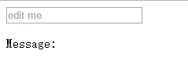

# Learn Vue

## 1 表单控件绑定

### 1.1 基础用法

你可以用 v-model 指令在表单控件元素上创建双向数据绑定。它会根据控件类型自动选取正确的方法来更新元素。尽管有些神奇，但 v-model 本质上不过是语法糖，它负责监听用户的输入事件以更新数据，并特别处理一些极端的例子。


实例：
[DOME1](./html/dome1.html)



>注：这里可以看出 v-model 忽略表单控件初始化所生成的值。并且如果 Vue 实例数据（model 绑定的值）来如果存在，会将实例数据作为具体的值。

实例：

[DOME2](./html/dome2.html)

```html
<div id="wrap">
    <p style="white-space:pre">message:{{message}}</p><br/>
    <textarea v-model='message'>{{message}}</textarea>
</div>
<script type="text/javascript">
    var vm = new Vue({
        el: '#wrap',
        data: {
            message:''
        }
    })
</script>
```

注：

- 这里可以看出，数值不能直接插入的textarea标签中，需要 v-model 配合
- 通过 `style="white-space:pre"` 可以保留回车和空格类似于 pre 标签

1. 复选框

    使用逻辑值

    [DOME3](./html/dome3.html)

    ```html
    <div id="wrap">
        <input type="checkbox" v-model='checked' name="" id="checkbox">
        <label for="checkbox">{{checked}}</label>
    </div>
    <script type="text/javascript">
        var vm = new Vue({
            el:'#wrap',
            data: {
                checked: true
            }
        })
    </script>
    ```
    如果没有指明 val 值，就会绑定表示是否选中的布尔值；
    多个勾选框，绑定到同一个数组：

    [DOME4](./html/dome4.html)

    ```html
    <div id="wrap">
        <input type="checkbox" id="jack" value="Jack" v-model="checkedNames">
        <label for="jack">Jack</label>
        <input type="checkbox" id="john" value="John" v-model="checkedNames">
        <label for="john">John</label>
        <input type="checkbox" id="mike" value="Mike" v-model="checkedNames">
        <label for="mike">Mike</label>
        <p>{{checkedNames}}</p>
    </div>
    <script type="text/javascript">
        var vm = new Vue({
            el:'#wrap',
            data: {
                checkedNames: []
            }
        })
    </script>
    ```

    - 注：如果绑定的数据是数组格式，就会没选中一个就会想数组添加一个value值，如果是其他格式会作为逻辑值处理

2. 单选按钮

    [DOME5](./html/dome5.html)

    ```html
    <div id="wrap">
        <input type="radio" id="one" value="One" v-model="picked">
        <label for="one">One</label>
        <br>
        <input type="radio" id="two" value="Two" v-model="picked">
        <label for="two">Two</label>
        <br>
        <span>Picked: {{ picked }}</span>
    </div>
    <script type="text/javascript">
        var vm = new Vue({
            el: '#wrap',
            data: {
                picked: ""
            }
        })
    </script>
    </body>
    ```

    - 注： 单选按钮：会选择单选按钮的value值与数据绑定

3. 选择列表

    - 单选列表
        [DOME6](./html/dome6.html)

        ```html
        <div id="wrap">
            <select class="sel" v-model="op" name="">
                <option disabled value="">请选择</option>
                <option value="name">ff</option>
                <option value="age">24</option>
            </select>
            <p>{{op}}</p>
        </div>
        <script type="text/javascript">
            var vm = new Vue({
                el:'#wrap',
                data: {
                    op: ""
                }
            })
        </script>
        ```

    - 注： 使用下来菜单绑定数据，会将选中的选项的value值与数据绑定； 如果 v-module 绑定的数据没有其对应的选项，就会执行未选中状态渲染，而在 IOS 中点击了第一个选项，就不会触发渲染，因为其没有触发 change 事件；所以建议使用一个 option 进行站位，并标注为 disable

    - 多选列表

        [DOME7](./html/dome7.html)

        ```html
        <div id="wrap">
            <select v-model='op' multiple>
                <option value="name">ff</option>
                <option value="age">24</option>
                <option value="job">student</option>
            </select>
            <p>{{op}}</p>
        </div>
        <script type="text/javascript">
            var vm = new Vue({
                el:'#wrap',
                data: {
                    op: []
                }
            })
        </script>
        ```

    - 注：在多选中只能绑定数组，选中的选项的value值会push到数据中

4. 动态选项，用v-for渲染

    [DOME8](./html/dome8.html)

    ```html
    <div id="wrap">
        <select class="" name="" v-model="selected">
            <option v-for='val in option' v-bind:value="val.value">
                {{val.text}}
            </option>
        </select>
        <p>{{selected}}</p>
    </div>
    <script type="text/javascript">
        var vm = new Vue({
            el: '#wrap',
            data: {
                selected: 'name',
                option: [
                    {text:'ff', value:'name'},
                    {text:'24', value:'age'},
                    {text:'student', value:'job'}
                ]
            }
        })
    </script>
    ```

## 1.2 绑定value

对于单选按钮，勾选框及选择列表选项， v-model 绑定的 value 通常是静态字符串（对于勾选框是逻辑值）：
但是有时我们想绑定 value 到 Vue 实例的一个动态属性上，这时可以用 v-bind 实现，并且这个属性的值可以不是字符串

以复选框为例
[DOME9](./html/dome9.html)

```html
<div id="wrap">
    <input
        type="checkbox"
        v-model='toggle'
        v-bind:true-value='a'
        v-bind:false-value='b'
        >
    <p>{{toggle}}</p>
</div>
<script type="text/javascript">
    var vm =　new Vue({
        el:"#wrap",
        data: {
            toggle: '选择',
            a: 'name:ff',
            b: 'name:xl'
        }
    })
</script>
```

- 注: 这里的true-value & false-value 是修饰符；

## 1.3 修饰符

- .lazy

    这里相当于触发了change的时候触发，如果没有就是触发的是input

    [DOME10](./html/dome10.html)

    ```html
    <div id="wrap">
        <input type="text" name="" id="" placeholder="edit" v-model.lazy="message">
        <p>{{message}}</p>
    </div>
    <script type="text/javascript">
        var vm = new Vue({
            el: '#wrap',
            data: {
                message: ''
            }
        })
    </script>
    ```

    - 注：失去焦点的时候，改变数据

- .number

    ```html
    <div id="wrap">
        <input type="number" name="" v-model.number='age' id="" @input='handleInput'>
    </div>
    <script type="text/javascript">
        var el = wrap.getElementsByTagName('input')[0];
        var vm = new Vue({
            el:"#wrap",
            data: {
                age: '22'
            },
            methods: {
                handleInput: function (){
                    console.log(typeof el.value); // string
                }
            }
        });
        console.log(typeof vm.age); // string
    </script>
    ```
    原文中说的是：如果想自动将用户的输入值转为 Number 类型（如果原值的转换结果为 NaN 则返回原值），可以添加一个修饰符 number 给 v-model 来处理输入值：在 type="number" 时 HTML 中输入的值也总是会返回字符串类型。

    但是 是否带有`.number` 在获取`input.value`的时候都是字符串，在获取数据的时候都是数组格式，不是很懂。

- .trim

    如果要自动过滤用户输入的首尾空格，可以添加 trim 修饰符到 v-model 上过滤输入：

### 1.4 v-module 与 组件

如果 HTML 内建 input 类型不能满足你的需求；就需要组件（自定义 input）;  

