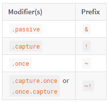
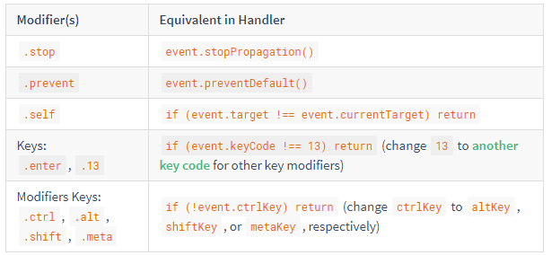

# Learn Vue

## 1. Render函数

### 1.1 基础

VUE 推荐使用 template 创建 HTML，但是在一些场景中使用模板会造成代码的冗长；

[dome1](./html/dome.html)

```html
    <div id="app">
        <my-template :level="1">Hello world!</my-template>
    </div>
    <script>
        Vue.component("my-template", {
            template: `<div>
                <h1 v-if="level === 1">
                    <slot></slot>
                </h1>
                <h2 v-if="level === 2">
                    <slot></slot>
                </h2>
                <h3 v-if="level === 3">
                    <slot></slot>
                </h3>
                <h4 v-if="level === 4">
                    <slot></slot>
                </h4>
                <h5 v-if="level === 5">
                    <slot></slot>
                </h5>
                <h6 v-if="level === 6">
                    <slot></slot>
                </h6>
            </div>`,
            props: {
                level: {
                    type: Number
                }
            }
        });
        var app = new Vue({
            el: '#app'
        })
    </script>
```

简单的说一下：这里表达的是 通过使用不同的 level 引用不同的标签将内容包裹;
使用 template 来实现，代码就十分的冗长了；

这种情况下就引入了 render 函数的概念。render 比 template 更接近编译器：将编译的工作完全交给 JavaScript；

这里使用 render 函数，简单的改写这个示例：

```html
    <div id="app">
        <my-template :level="1">Hello world!</my-template>
    </div>
    <script>
        Vue.component('my-template', {
            render: function(createElement) {
                return createElement(
                    'h' + this.level,
                    this.$slots.default
                )
            },
            props: {
                level: {
                    type: Number
                }
            }
        });
        var app = new Vue({
            el: "#app"
        })
    </script>
```

- 注：
    在官方文档中，这一块的示例也是十分有意思的：[官方示例](./html/reback.html)；里面使用了 script 标签，来写 template 结构；
    
### 1.2 render函数

1. createElement 参数

    render 函数是通过 createElement 来生成的模板，这里简单的介绍一下 createElement

        ```js
            // @returns {VNode}
            createElement(
                // {String | Object | Function} 
                // 一个 HTML 标签字符串，组件选项对象，或者一个返回值类型为String/Object的函数，必要参数
                'div',
                // {Object}
                // 一个对应属性的数据对象
                // 您可以在 template 中使用.可选项.
                {
                    // (下一章，将详细说明相关细节)
                },
                // {String | Array}
                // 子节点(VNodes). 可选项.
                [
                    createElement('h1', 'hello world'),
                    createElement(MyComponent, {
                        props: {
                            someProp: 'foo'
                        }
                    }),
                    'bar'
                ]
            )
        ```

    例如：[dome](./html/dome3.html)

        ```html
            <div id="app">
                <my-template></my-template>
            </div>
            <script>
                Vue.component('my-template', {
                    render: function(createElement) {
                        return createElement("div",[
                            '先写一些文字',
                            createElement('em', 'one'),
                            createElement('h1', 'two'),
                        ])
                    }
                })
                var app = new Vue({
                    el: "#app"
                })
            </script>
        ```

    生成的结构：

        ```html
            <div>先写一些文字<em>one</em><h1>two</h1></div>
        ```

    - 注：通过 createElement 返回的是一个 VNode 对象；

2. 深入 data Object 参数

    在 VNode 数据对象中，下列属性名是级别最高的字段。该对象也允许你绑定普通的 HTML 特性，就像 DOM 属性一样

    - 简单的介绍一下：
        class -- 绑定class 属性：使用的时候需要加引号
        style -- 绑定样式，可以通过对象的形式添加样式属性
        attrs -- 添加 attribute 属性
        props -- 组件
        domPors -- DOM 属性：例如使用innerHTML
        on -- 绑定事件
        nativeOn -- 在调用模板的时候绑定原生事件
        directives -- 暂时没有接触到
        scopedSlots -- 暂时没有接触到
        slot -- 暂时没有接触到
        key -- 暂时没有接触到
        ref -- 提取元素

    - 示例：

            ```js
                {
                    // 和`v-bind:class`一样的 API
                    'class': {
                        foo: true,
                        bar: false
                    },
                    // 和`v-bind:style`一样的 API
                    style: {
                        color: 'red',
                        fontSize: '14px'
                    },
                    // 正常的 HTML 特性
                    attrs: {
                        id: 'foo'
                    },
                    // 组件 props
                    props: {
                        myProp: 'bar'
                    },
                    // DOM 属性
                    domProps: {
                        innerHTML: 'baz'
                    },
                    // 事件监听器基于 "on"
                    // 所以不再支持如 v-on:keyup.enter 修饰器
                    // 需要手动匹配 keyCode。
                    on: {
                        click: this.clickHandler
                    },
                    // 仅对于组件，用于监听原生事件，而不是组件使用 vm.$emit 触发的事件。
                    nativeOn: {
                        click: this.nativeClickHandler
                    },
                    // 自定义指令. 注意事项：不能对绑定的旧值设值
                    // Vue 会为您持续追踨
                    directives: [{
                        name: 'my-custom-directive',
                        value: '2'
                        expression: '1 + 1',
                        arg: 'foo',
                        modifiers: {
                            bar: true
                        }
                    }],
                    // Scoped slots in the form of
                    // { name: props => VNode | Array<VNode> }
                    scopedSlots: {
                        default: props => h('span', props.text)
                    },
                    // 如果子组件有定义 slot 的名称
                    slot: 'name-of-slot'
                    // 其他特殊顶层属性
                    key: 'myKey',
                    ref: 'myRef'
                }
            ```

    - 使用实例：

        [dome4](./html/dome4.html)

        ```html
            <div id="app">
                <my-template :level="2">
                    <h1>This.is.a.tempalte</h1>
                </my-template>
            </div>
            <script>
                var getChildrenTextContent = function(children) {
                    return children.map(function(item) {
                        return item.children ? getChildrenTextContent(item.children) : item.text
                    }).join('')
                };
                Vue.component('my-template', {
                    render: function(createElement) {
                        var headingId = getChildrenTextContent(this.$slots.default)
                            .toLowerCase()
                            .replace(/\W+/g, '-')
                            .replace(/(^\-|\-$)/g, '');
                        return createElement(
                            'h' + this.level, [
                                createElement('a', {
                                    attrs: {
                                        name: headingId,
                                        href: '#' + headingId,
                                    }
                                }, this.$slots.default)
                            ]
                        )
                    },
                    props: {
                        level: {
                            type: Number
                        }
                    }
                })
                var app = new Vue({
                    el: "#app"
                })
            </script>
        ```

    渲染成：

        ```html
            <div id="app">
                <h2>
                    <a name="this-is-a-tempalte" href="#this-is-a-tempalte">
                        <h1>This.is.a.tempalte</h1>
                    </a>
                </h2>
            </div>
        ```

    简单的解释一下：
    这个实例是将：模板标签的内容变成一个 a 标签的内容，其中 name 和 href 是通过 data Object 的属性转换而成的

3. 约束

    注：源文档所下面这种方式，是无法渲染的，经过试验发现是可以的：

        ```js
            Vue.component('my-template', {
                render: function(createElement) {
                    var tep = createElement('p', 'this is a tep');  
                    return createElement("div",[
                        tep,
                        tep
                    ])
                }
            })
            var vm = new Vue({
                el: '#app'
            })
        ```
    [reback2](./html/reback2.html)

    如果需要重复渲染一个标签可以使用：

        ```js
            Vue.component('my-template', {
                render: function(createElement) {
                    return createElement('div',
                        Array.apply(null, {
                            length: 10
                        }).map(function() {
                            return createElement('p', 'title');
                        })
                    )
                }
            });
            var app = new Vue({
                el: '#app'
            })
        ```

    - 注：

            ```js
                
                var a = Array.apply(null, {
                    length: 4
                }).map(function() {
                    return 1;
                })
                console.log(a); // [1, 1, 1, 1]
            ```


### 1.3 使用 JavaScript 代替模板功能

1. vue 的 render 函数中不会提供 vue 的方法，例如 v-if || v-for || v-model 如果需要就需要使用 js 来实现其功能；

2. v-model
    在 render 函数中，没有和 v-model 相应的 api，所以如果需要使用表单-数据绑定，就需要自己实现；

        ```js
        render: function (createElement) {
        var self = this
        return createElement('input', {
            domProps: {
            value: self.value
            },
            on: {
            input: function (event) {
                self.value = event.target.value
                self.$emit('input', event.target.value)
            }
            }
        })
        }
        ```
        
2. Event & Key Modifiers

    在事件中vue提供了一些可以使用的前缀，

    - .passive => &
    - .capture => !
    - .once => ~
    - .capture.once or .once.capture => ~!

    例如：

     ```js
        on: {
            '!click': this.doThisInCapturingMode,
            '~keyup': this.doThisOnce,
            `~!mouseover`: this.doThisOnceInCapturingMode
            }
     ```

    而对于其余事件需要使用js进行模拟；

    
    

    - 注：
        .passive 是最近新出的一个功能，目前只有 chrome 和 Firefox 实现了
        以前的事件绑定是这样的：`addEventListener(type, listener, useCapture)`
        最后一个参数，也就是控制监听器是在捕获阶段执行还是在冒泡阶段执行的 useCapture 参数，现在变成了可选参数（传 true 的情况太少了），成了：
        `addEventListener(type, listener[, useCapture ])`
        而 passive 就是其中的一个配置项，当使用了 {passive:true} 以后，就相当于直接告诉浏览器，你直接执行吧，我这里并没有阻止你的默认事件；
        
3. Slots

    我们可以从 this.$slots 中获取 VNodes 列表中的静态内容；

        ```html
            <div id="app">
                <my-template>这个是模板内部的文字，可以通过 this.$slots.default 来获取</my-template>
            </div>
            <script>
                Vue.component('my-template', {
                    render: function (createElement) {
                        return createElement('em', this.$slots.default)
                    }
                });

                var vm = new Vue({
                    el: '#app'
                });

            </script>
        ```