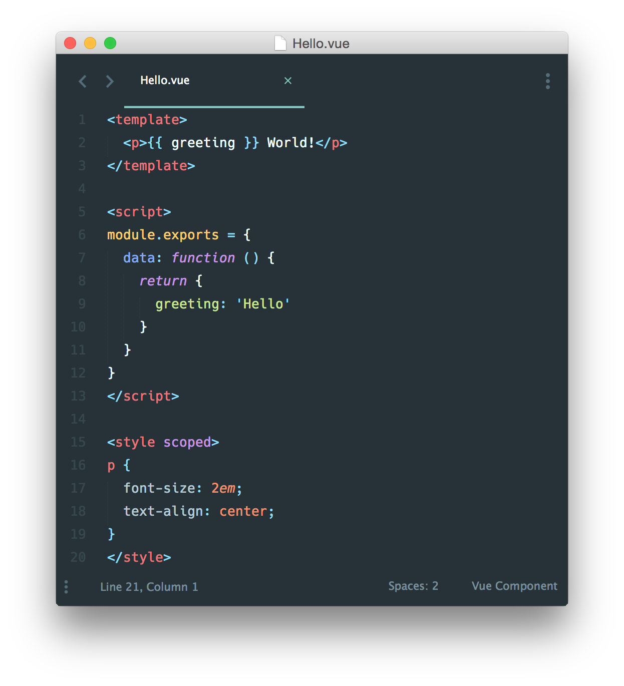

# Learn Vue

## 单文件组件

介绍

在很多Vue项目中，我们使用 Vue.component 来定义全局组件，紧接着用 new Vue({ el: '#container '}) 在每个页面内指定一个容器元素。但是这种写法存在下列问题：

- 全局定义(Global definitions) 强制要求每个 component 中的命名不得重复
- 字符串模板(String templates) 缺乏语法高亮，在 HTML 有多行的时候，需要用到丑陋的 \
- 不支持CSS(No CSS support) 意味着当 HTML 和 JavaScript 组件化时，CSS 明显被遗漏
- 没有构建步骤(No build step) 限制只能使用 HTML 和 ES5 JavaScript, 而不能使用预处理器，如 Pug (formerly Jade) 和 Babel

可以通过文件扩展名为 .vue 的 single-file components(单文件组件) 为以上所有问题提供了解决方法，并且还可以使用 Webpack 或 Browserify 等构建工具。
这是一个文件名为 Hello.vue 的简单实例：

现在我们获得：
- 完整语法高亮
- CommonJS 模块
- 组件化的 CSS

正如我们说过的，我们可以使用预处理器来构建简洁和功能更丰富的组件，比如 Jade，Babel (with ES2015 modules)，和 Stylus。

这些特定的语言只是例子，你可以只是简单地使用 Buble，TypeScript，SCSS，PostCSS - 或者其他任何能够帮助你提高生产力的预处理器。
