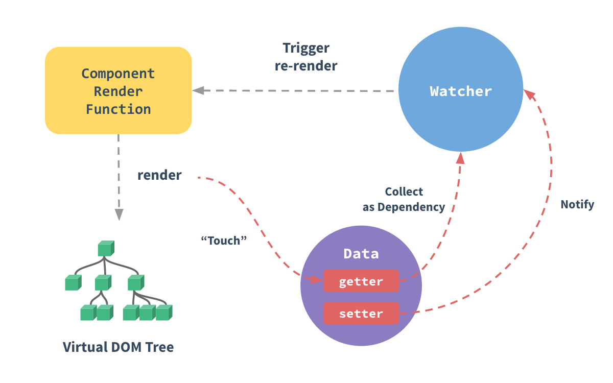

# Learn Vue -- Level2

## 1. 深入理解响应式原理

Vue 显著的特点就是响应式系统，简单地说就是通过修改 model 层，来控制 view 的更新，这一节就深入的了解一下其中的原理；

### 1.1 如何追踪变化

通过设置访问器属性（getter， setter）来实现数据的绑定；

在 vue 中，将一个JavaScript对象传递给 Vue 实例的 data 选项，然后 Vue 将遍历这个选项，然后使用`Object.defineProperty`把 这些属性全部转换成 getter/setter 

用户无法查看 getter/setter 但是内部他们让 Vue 追踪依赖，当发生访问（getter）或者修改（setter）时通知变化，但是在浏览器中打印数据对象的时候 getter/setter 的格式化并不相同，所以需要安装 vue-devtools 来获取更加有好的检测接口的方式；

每个组件实例都有相应的 watcher 实例对象，它会在组件渲染的过程中把属性记录为依赖，之后当依赖项的 setter 被调用时，会通知 watcher 重新计算，从而致使它关联的组件得以更新。



- 注：`Object.defineProperty` 仅仅支持IE8 以上（IE8的支持也是有很大问题的），这也是Vue不支持IE8 及更低浏览器的原因；

### 1.2 变化检测的问题

受现代 Javascript 的限制（以及废弃 Object.observe），Vue **不能检测到对象属性的添加或删除**。由于 Vue 会在初始化实例时对属性执行 getter/setter 转化过程，所以属性必须在 data 对象上存在才能让 Vue 转换它，这样才能让它是响应的。例如：

```js
  var vm = new Vue({
    data:{
      a:1
    }
  })
  // `vm.a` 是响应的
  vm.b = 2
  // `vm.b` 是非响应的
```

那么如何才能在已有实例上添加新的根级响应式的属性呢？
由于 Vue 是在初始化的时候进行注册相应的属性，所以才导致后来无法添加响应的属性。我们可以使用手动注册响应属性的方式来对属性注册，这样这个属性就保留了响应的特性了，具体方式：

1. 使用 Vue.set(Object, key, value)
2. 使用 vm.$set(this.someObject, key, value) -- vm 是指 vue 实例

如果想在已有对象上添加一些属性，可以使用 Object.assign() 将属性拷贝到一个对象中，在对这个队形重新注册；例如：

```js
  // 代替 `Object.assign(this.someObject, { a: 1, b: 2 })`
  this.someObject = Object.assign({}, this.someObject, { a: 1, b: 2 })
  Vue.set(Object, key, value)
```

### 1.3 声明响应式属性

由于 Vue 不允许动态添加根级响应式属性，所以必须在初始化实例前声明根级响应式属性，哪怕只是一个空值:

```js
  var vm = new Vue({
    data: {
      // 声明 message 为一个空值字符串
      message: ''
    },
    template: '<div>{{ message }}</div>'
  })
  // 之后设置 `message` 
  vm.message = 'Hello!'
```

### 1.4 异步更新队列

Vue 异步执行 DOM 更新，只要观察到数据发生了变化， Vue 将开启一个队列，用于缓冲在同一个事件循环中发生的数据改变，并且如果同一个 watcher 被触发了多次，也仅仅只会向队列中推入一次；然后再进入下一个事件循环中，vue 才会刷新队列，并执行实际工作；

Vue 在内部尝试对异步队列使用原生的 Promise.then 和 MutationObserver，如果执行环境不支持，会采用 setTimeout(fn, 0) 代替。

示例：当你设置了 vm.someData = "new Value" 发生了什么；

1. 事件进入队列
2. 刷新队列
3. DOM 状态更新

这时我们需要在 DOM 状态更新后，再次改变数据，那如何检测到 DOM 状态已经更新了呢？

在 Vue 内部提供了一个回调方法会在 DOM 状态更新结束后触发 -- Vue.nextTick(callback)

- 示例1:

  ```js
    Vue.component('example', {
      template: '<span>{{ message }}</span>',
      data: function () {
        return {
          message: '没有更新'
        }
      },
      methods: {
        updateMessage: function () {
          this.message = '更新完成'
          console.log(this.$el.textContent) // => '没有更新'
          this.$nextTick(function () {
            console.log(this.$el.textContent) // => '更新完成'
          })
        }
      }
    })
  ```

- 示例2

  ```html
    <div @click="updata">
      {{message}}
    </div>
    <script>
      var vm = new Vue({
        el: 'div',
        data: {
          message: '没有更新'
        },
        methods: {
          updata: function () {
            this.message = '更新完成',
              console.log(this.$el.textContent) // 没有更新
            this.$nextTick(function () {
              console.log(this.$el.textContent) // 更新完成
            })
          }
        }
      })
    </script>
  ```