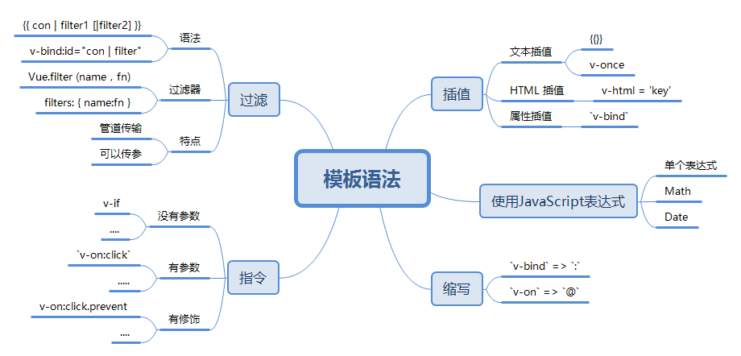

# LearnVue

以官方文档为基础学习Vue框架

[VUE](http://cn.vuejs.org/v2/guide/installation.html)

## 1. 简介

介绍了VUE相关的基本使用

## 2. VUE 实例

介绍了 el、data、watch、生命周期

## 3. VUE 模板语法

介绍了 常用指令：v-once 常用方法：v-on、v-html、v-bind、v-if 过滤器：filter、filters...

## 4. VUE 计算属性

介绍了 计算属性-computed 以及一些能够同样行为操作： watch、methods、get、set

## 5. VUE class 与 style 绑定

介绍了 class 与 style 绑定相关的操作

## 6. 条件渲染&&列表渲染

介绍了
条件渲染：v-if、v-else-if、v-else、key、v-show;
列表渲染：v-for、$emit、key、Vue.set();

## 7. 事件处理器

介绍了 v-on、methods、$event、修饰符

## 8. 表单控件绑定

介绍了 v-model、true-value & false-value、修饰符

## 9. 组件

介绍了 component、components、data、template、props、data修饰符、props 验证

