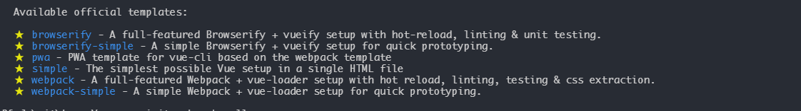

# Vue-cli 解读

## 什么是 vue-cli 

vue-cli 是搭建 vue 项目的脚手架工具，用于建立起 vue 项目的基础框架，和工作环境；

## 基础

### 1.1 如何使用 vue-cli

1. 起步：
    安装 node；
    安装 vue-cli: `cnpm i -g vue-cli`

2. 终端运行：
    - 输入：vue -- 查看 vue-cli 基础命令
    - vue-list -- 查看都有哪些模板 (这些模板在其 git 地址中都有做介绍)
        
    - vue init webpack projectName -- 搭建项目目录
    - cnpm i -- 安装基础依赖的包

3. 开启服务：
    - npm run dev

### 1.2 目录简介

1. 基础
    .babelrc -- babel 配置
    .editorconfig -- 编辑器配置（代码风格）
    .eslintignore -- 对哪些文件忽略 eslint 代码检测
    .eslintrc.js -- eslint 的配置文件
    .gitignore -- git 忽略的文件
    index.html -- 项目的入口文件
    package -- 项目的配置文件
